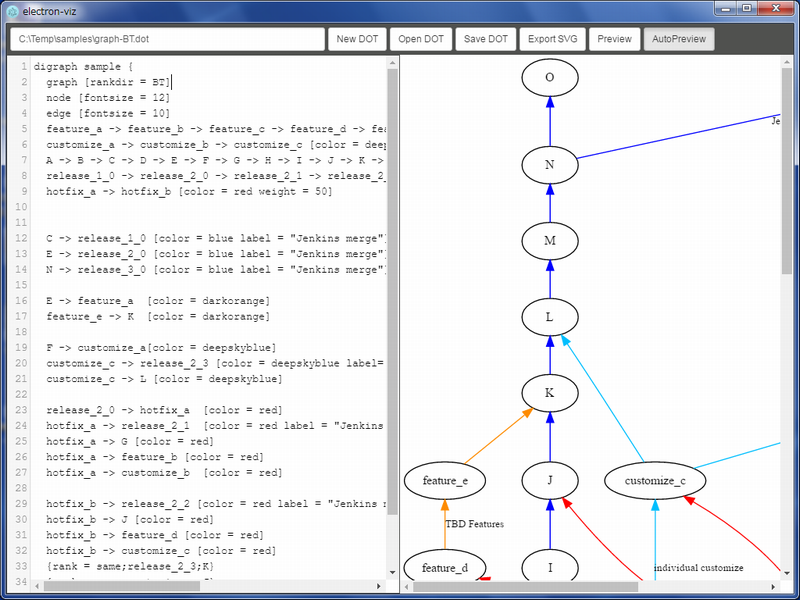

# electron-viz

electron で作成した graphviz のビューア/エディタ。

* dotファイルをsvgに変換し、表示します。
* エディタ部分で編集した内容がリアルタイムに反映されます。
* svgファイルを保存します。

## TODO

* ショートカットキーの実装

## 参考

* [Graphviz](http://www.graphviz.org/Home.php)
* [Viz.js](https://github.com/mdaines/viz.js)
* [electron](http://electron.atom.io/)
* [Graphvizとdot言語でグラフを描く方法のまとめ](http://qiita.com/rubytomato@github/items/51779135bc4b77c8c20d)
* http://www.showa-corp.jp/special/graphtools/graphviz.html

## LICENSE

MIT
